<!-- Animated Contribution Graph -->

  

<!-- Terminal ASCII Art + Info Card Side by Side -->
<table>
  <tr>
    <td valign="centre"></td>
    <td valign="top"></td>
  </tr>
</table>

<!-- HERO SECTION -->

  

  <h3><strong>Embedded Systems & Edge AI Engineer | IoT Architect</strong></h3>
  
<i>Building smart hardware solutions, AI-powered embedded systems, and robust IoT architectures.</i>

  

    
    
    
    
  

  
  

 

<!-- ================= ABOUT ME ================= -->
<h2 align="center">🚀 About Me</h2>

<table width="100%" border="0">
<tr>
<td width="50%" valign="top" style="border: none; background: none;">

### 👨‍💻 Who am I?

* 🎓 **B.Tech ECE (2023–2027)** • Kalasalingam Academy (CGPA: 9.02)
* 💡 **Indian Patent Holder** – *PyroSentinel* AIoT Forest Fire Detection
* 📝 **IEEE Published Author** – Radiomics-Guided Lung Tumor Segmentation
* 💻 **Embedded & Edge AI Developer** bridging hardware + intelligence
* 🌱 Learning **Computer Vision, HIL Validation, Fog Computing**
* 🏆 **PR Team Lead** @ ACM SIGBED Student Chapter

<blockquote>
  

    <i>"I don't just write code. I engineer systems where hardware and intelligence seamlessly interact to solve real-world problems."</i>
  

</blockquote>

</td>

<td width="50%" align="center" valign="middle" style="border: none; background: none;">

</td>
</tr>
</table>

---

<!-- ================= TECHNICAL ARSENAL ================= -->

  

<table align="center" width="100%" border="0">
  <tr>
    <td align="center" width="33%" style="border: none; background: none;">
      <h4>⚙️ Microcontrollers & Embedded</h4>
      

         
         
         
        
      

    </td>
    <td align="center" width="33%" style="border: none; background: none;">
      <h4>🧠 AI & Computer Vision</h4>
      

         
         
         
        
      

    </td>
    <td align="center" width="33%" style="border: none; background: none;">
      <h4>🌐 IoT & Hardware Tools</h4>
      

         
         
         
        
      

    </td>
  </tr>
</table>

---

<!-- ================= FEATURED PROJECTS ================= -->

  

<table align="center" width="100%" border="0">
  <tr>
    <td align="center" width="50%" style="border: none; background: none;">
      
    </td>
    <td align="center" width="50%" style="border: none; background: none;">
      
    </td>
  </tr>
  <tr>
    <td align="center" width="50%" style="border: none; background: none;">
      
    </td>
    <td align="center" width="50%" style="border: none; background: none;">
      
    </td>
  </tr>
  <tr>
    <td align="center" width="50%" style="border: none; background: none;">
      
    </td>
    <td align="center" width="50%" style="border: none; background: none;">
      
    </td>
  </tr>
</table>

---

<!-- ================= HACKATHONS & ACHIEVEMENTS ================= -->

  

<table align="center" width="100%" border="0">
  <tr>
    <td align="center" width="50%" style="border: none; background: none;">
      <h3 align="center">🏅 Hackathons</h3>
      

          
          
          
        
      

    </td>
    <td align="center" width="50%" style="border: none; background: none;">
      <h3 align="center">🎯 Awards & Leadership</h3>
      

          
          
          
        
      

    </td>
  </tr>
</table>

---

<!-- ================= GITHUB STATS ================= -->

  

  
  

 

  

 

<!-- FOOTER -->

  

